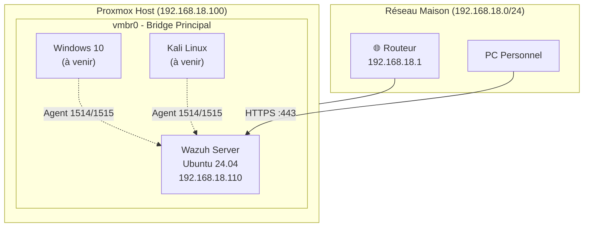
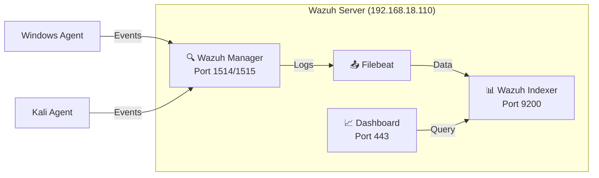

# Architecture

## Diagramme Réseau

```mermaid
flowchart TB
    subgraph HOME["Réseau Maison (192.168.18.0/24)"]
        ROUTER["🌐 Routeur<br/>192.168.18.1"]
        PC["PC Personnel"]
    end

    subgraph PROXMOX["Proxmox Host (192.168.18.100)"]
        subgraph BRIDGE["vmbr0 - Bridge Principal"]
            WAZUH["Wazuh Server<br/>Ubuntu 24.04<br/>192.168.18.110"]
            WIN["Windows 10<br/>(à venir)"]
            KALI["Kali Linux<br/>(à venir)"]
        end
    end

    ROUTER --- PROXMOX
    PC -->|"HTTPS :443"| WAZUH
    WIN -.->|"Agent 1514/1515"| WAZUH
    KALI -.->|"Agent 1514/1515"| WAZUH
```

## Composants Wazuh

```mermaid
flowchart LR
    subgraph WAZUH_SERVER["Wazuh Server (192.168.18.110)"]
        INDEXER["📊 Wazuh Indexer<br/>Port 9200"]
        MANAGER["🔍 Wazuh Manager<br/>Port 1514/1515"]
        DASHBOARD["📈 Dashboard<br/>Port 443"]
        FILEBEAT["📤 Filebeat"]
    end

    MANAGER -->|"Logs"| FILEBEAT
    FILEBEAT -->|"Data"| INDEXER
    DASHBOARD -->|"Query"| INDEXER

    AGENT1["Windows Agent"]
    AGENT2["Kali Agent"]

    AGENT1 -->|"Events"| MANAGER
    AGENT2 -->|"Events"| MANAGER
```
