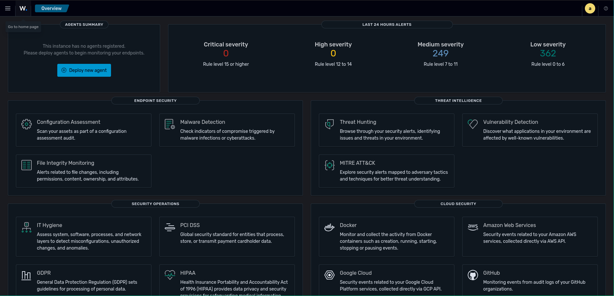

# Installation Wazuh Server - Single Node

## Prérequis

- VM Ubuntu Server 24.04 LTS
- 4GB RAM minimum
- 50GB disque
- Accès réseau (bridge vmbr0)

## Étape 1 : Configuration IP Statique

Modifier le fichier Netplan :

```bash
sudo nano /etc/netplan/50-cloud-init.yaml
```

Contenu :

```yaml
network:
  version: 2
  ethernets:
    ens18:
      dhcp4: no
      addresses:
        - 192.168.18.110/24
      routes:
        - to: default
          via: 192.168.18.1
      nameservers:
        addresses:
          - 8.8.8.8
          - 8.8.4.4
```

Appliquer :

```bash
sudo netplan apply
```

## Étape 2 : Télécharger l'installateur Wazuh

```bash
curl -sO https://packages.wazuh.com/4.14/wazuh-install.sh
curl -sO https://packages.wazuh.com/4.14/config.yml
```

## Étape 3 : Configurer config.yml

Éditer le fichier pour un déploiement single-node :

```yaml
nodes:
  indexer:
    - name: node-1
      ip: "192.168.18.110"

  server:
    - name: wazuh-1
      ip: "192.168.18.110"

  dashboard:
    - name: dashboard
      ip: "192.168.18.110"
```

## Étape 4 : Générer les certificats

```bash
sudo bash wazuh-install.sh --generate-config-files
```

## Étape 5 : Installer les composants

### Wazuh Indexer

```bash
sudo bash wazuh-install.sh --wazuh-indexer node-1
```

### Wazuh Server (Manager + Filebeat)

```bash
sudo bash wazuh-install.sh --wazuh-server wazuh-1
```

### Wazuh Dashboard

```bash
sudo bash wazuh-install.sh --wazuh-dashboard dashboard
```

Si erreur de connexion au cluster:

```bash
sudo bash wazuh-install.sh --start-cluster
```

## Étape 6 : Accéder au Dashboard

- **URL :** <https://192.168.18.110>
- **User :** admin
- **Password :**

```bash
sudo tar -xvf wazuh-install-files.tar wazuh-install-files/wazuh-passwords.txt -O
| grep -A 1 "admin"
```

## Vérification des services

```bash
sudo systemctl status wazuh-indexer
sudo systemctl status wazuh-manager
sudo systemctl status wazuh-dashboard
sudo systemctl status filebeat
```

## Résultat

Dashboard accessible avec monitoring du serveur Wazuh lui-même (self-monitoring).


