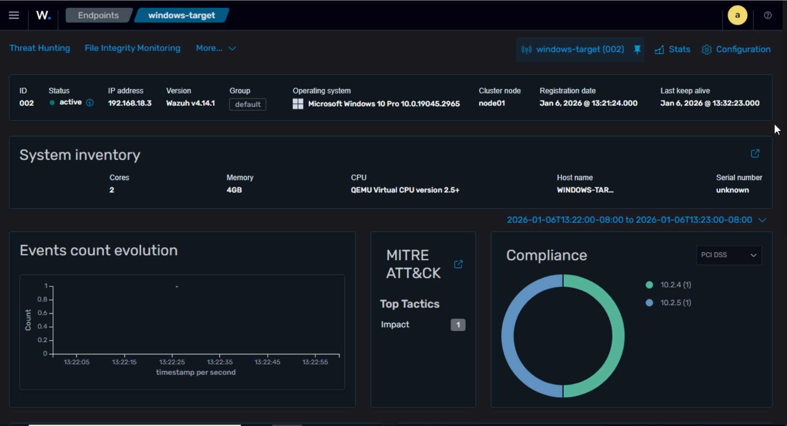

# Déploiement Agent Windows

## Prérequis

- VM Windows 10 Pro
- 4GB RAM, 40GB disque
- Connectivité réseau vers Wazuh server (192.168.18.110)

## Étape 1 : Création VM Windows sur Proxmox

### Configuration VM

| Paramètre | Valeur |
|-----------|--------|
| Name | windows-target |
| OS Type | Microsoft Windows 10/2016/2019 |
| Machine | q35 |
| BIOS | OVMF (UEFI) |
| Disk | VirtIO Block, 40GB |
| CPU | 2 cores |
| RAM | 4096 MB |
| Network | vmbr0, VirtIO |

### Drivers VirtIO

Windows ne reconnaît pas VirtIO nativement. Télécharger l'ISO :
```
https://fedorapeople.org/groups/virt/virtio-win/direct-downloads/stable-virtio/virtio-win.iso
```

Pendant l'installation Windows, quand aucun disque n'apparaît :
1. Cliquer "Charger un pilote"
2. Parcourir vers le CD VirtIO
3. Sélectionner `viostor\w10\amd64`
4. Le disque apparaît

Après installation, installer le driver réseau :
- `NetKVM\w10\amd64\netkvm.inf` → clic droit → Installer

## Étape 2 : Déployer l'agent Wazuh

### Depuis le Dashboard

1. Accéder à https://192.168.18.110
2. Cliquer "Deploy new agent"
3. Sélectionner Windows
4. Server address : `192.168.18.110`
5. Copier la commande PowerShell

### Sur la VM Windows

1. Ouvrir PowerShell en Administrateur
2. Coller et exécuter la commande générée

### Vérification
```powershell
Get-Service WazuhSvc
```

Le service doit être "Running".

## Étape 3 : Vérifier dans Wazuh Dashboard

- Agents → L'agent Windows apparaît avec statut "Active"
- Security events → Les événements Windows sont collectés

## Test de validation

Générer des failed logins pour vérifier la détection :
1. Win + L (verrouiller la session)
2. Taper un mauvais mot de passe 5-6 fois
3. Vérifier les alertes dans le dashboard

## Résultat

Agent connecté et alertes visibles dans Wazuh.


