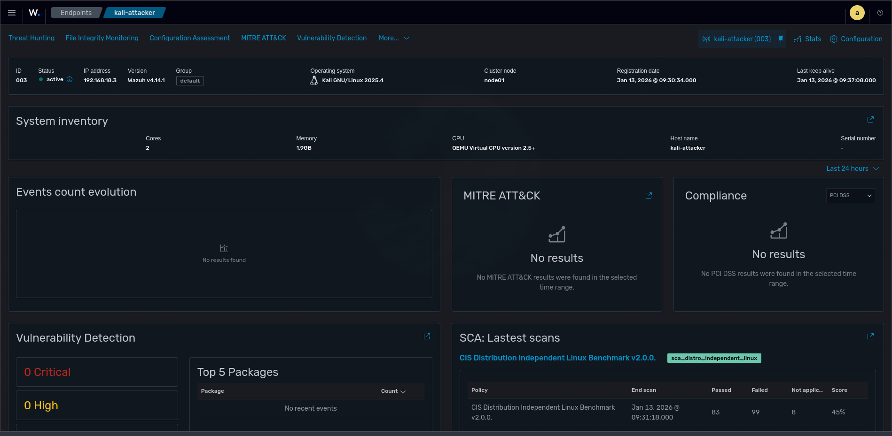

# Déploiement Agent Kali Linux

## Prérequis

- VM Kali Linux 2025.x
- 2GB RAM, 30GB disque
- Connectivité réseau vers Wazuh server (192.168.18.110)

## Étape 1 : Création VM Kali sur Proxmox

### Configuration VM

| Paramètre | Valeur |
|-----------|--------|
| Name | kali-attacker |
| OS Type | Linux, Kernel 6.x |
| Machine | q35 |
| BIOS | SeaBIOS |
| Disk | VirtIO Block, 30GB |
| CPU | 2 cores |
| RAM | 2048 MB |
| Network | vmbr0, VirtIO |

### Installation

- Graphical Install
- Partitionnement : tous les fichiers sur une partition
- Desktop : Xfce (léger) ou défaut

## Étape 2 : Installer l'agent Wazuh

Passer en root :

```bash
sudo su
```

Ajouter la clé GPG :

```bash
curl -s https://packages.wazuh.com/key/GPG-KEY-WAZUH | gpg --no-default-keyring --keyring gnupg-ring:/usr/share/keyrings/wazuh.gpg --import && chmod 644 /usr/share/keyrings/wazuh.gpg
```

Ajouter le repo :

```bash
echo "deb [signed-by=/usr/share/keyrings/wazuh.gpg] https://packages.wazuh.com/4.x/apt/ stable main" | tee /etc/apt/sources.list.d/wazuh.list
```

Installer l'agent :

```bash
apt update && apt install wazuh-agent -y
```

## Étape 3 : Configurer l'agent

Éditer la configuration :

```bash
nano /var/ossec/etc/ossec.conf
```

Modifier l'adresse du serveur :

```xml
<server>
  <address>192.168.18.110</address>
</server>
```

Démarrer l'agent :

```bash
systemctl daemon-reload
systemctl enable wazuh-agent
systemctl start wazuh-agent
```

## Étape 4 : Vérification

Sur Kali :

```bash
systemctl status wazuh-agent
```

Dans le dashboard Wazuh :

- Agents → kali-attacker apparaît avec statut "Active"

## Résultat

Agent Kali connecté et prêt pour les simulations d'attaque.


